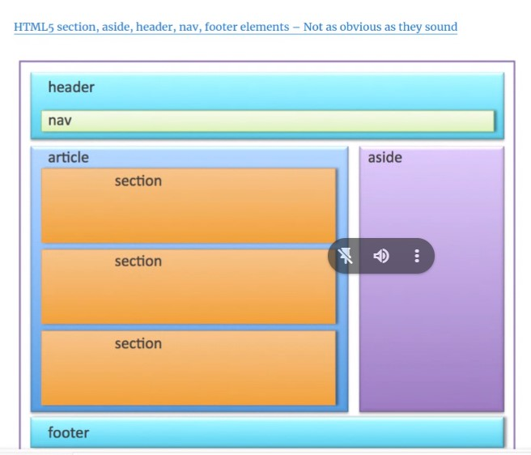
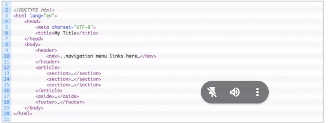
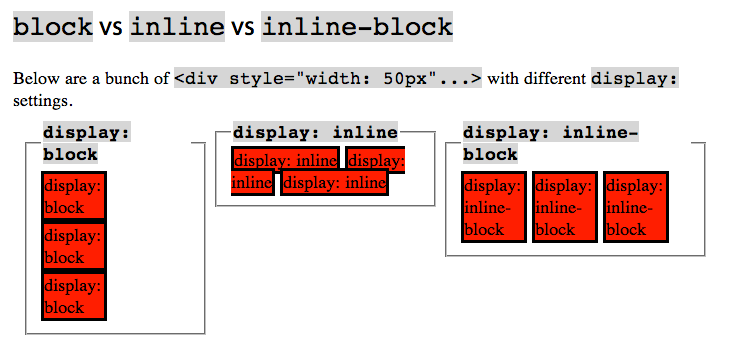

# Intro do HTML and CSS
# HTML
## Using GitHub Pages
<!-- in order to create my own developer landing page -->
> Source: https://dev.to/flexdinesh/create-your-developer-landing-page-with-github-pages---42jk

Resources: 
- https://www.w3.org/ 
    - https://validator.w3.org/#validate_by_uri
- https://pagespeed.web.dev/?hl=fr
- google lighthouse
- https://docs.google.com/presentation/d/1ZncEV7bkCz3BcAS4gZYSneXz1jJB_PC0IiD-CMe2VRU/edit#slide=id.g2df84913ed4_0_72

Bonus:

- Attention au dimension d'images, **bonne taille** pour mon site, car images sont lourdes pour le telechargement. Images déja redimensionnée avant le site c'est l'idéale. (photoshop, gimp, online)

### How to do it with a github account

```
But with GitHub Pages, publishing your site is as easy as drinking a coffee.

- You need a GitHub account (you obviously have one already)
- Create a new repo with the name {username}.github.io
- Clone the repo and create an index.html file
- Add some content and git push
- Voila! Your site should be live at https://{username}.github.io in seconds.
```
For my case it will be: https://LuanPM284.github.io

---

### Setup the files
Go to the desired location and create a directory, initiate a git and add the index.html file.
```
pwd
ls -al
cd
mkdir dev_landing_page
git init
touch index.html
```
Next we need to add the file to stage, and commit in order to send back to my repository.
```
git add .
git commit -m "my index page"
```
And push it to the github repository.
```
git remote add origin https://github.com/LuanPM284/LuanPM284.github.io.git
git branch -M main
git push -u origin main
```
**Do not forget to add and commit any changes before pushing, else nothing will be sent.**
```
git add.
git commit -m "modifications"
git push
```
I cloned the original repository so I could have access to the CSS folder, I copied to my own folder later. Deleting the rest.
```bash
git clone https://github.com/flexdinesh/dev-landing-page.git
ls
cd dev-landing-page
cp -r css D:/Code/BeCode/dev_landing_page
cd ..
rm dev-landing-page
```
add/commit/push

---
create internal links
[ clickable] followed by (# the tag that is created automaticly when a heading is created)

### Index
- [Some common used elements](#some-common-used-elements)  
- [1 Html attributes](#html-attributes) 
    - [Alt Exercices](#alt-exercice) 
- [2 CSS](#css) 
    - [Concept 1 CSS Selectors](#concept-1-css-selectors) 
    - [Concept 1 CSS Selectors part 2](#css-selectors-part-2) 
    - [Concept 2 CSS Block Model](#concept-2-block-model) 
    - [Concept 3 Positionning](#concept-3-css-positioning) 
- [Extra: Learning Grid](#learning-grid)
- [3 Web Fonts](#3-web-fonts)
- [4 Useful tools](#4-useful-tools)
- [5 Exercices to finish module](#5-exercises-to-finish-this-sprint)
- [Other usefull things](#other-usefull-things)
    - [Bro code](#bro-code-videos-on-html-and-css-to-help-with-general-flow-of-things)


---
### Progressive enhancement

(HTML => CSS => JS)*Accessibility

- https://dotnetinter.livejournal.com/78240.html

#### Tags Exercice

Edit the texte file: doc-the-chinse-farmer.txt using semantics. Or the different tags so that the texte is divided in blocks that we can later use to add style.
#### Some common used elements

source of explanations: https://html5doctor.com/

The different names of the tags:

- `h1` : heading 1, the 1 is for the size. Going from the largest 1 to the smallest 6
- `br`: blockquote used for breaking a line, not used to separate thematic groups on paragraphs
- `q` : for quoting other sources
- `img` : image element, given by the src
- `hr` : used to separate different sections on a same section of prose, or paragraph, creates line
- `figure` : represents some flow content, often used with `caption`, references to a single unit
- `caption` : represents the title of the `table` parent
- `table` : representation of data in more than one dimension, not used as layout aids
- `th` : table header of a cell in a table
- `tr` : represents the row of a cell in a table
- `td` : the data cell in a table
- `ul` : unordered list
- `ol` : ordered list
- `li` : list item, has as parent `ul` or `ol`
- `div` : has no special meaning, represents its children, can be used with other elements, semanticless
- `span` : has no special meaning, represents its children, can be used with other elements, semanticless
- `a` : if `href` than hyperlink, else a placeholder for a link
- `header` : represents the header of a document, contains usualy h1-h6 elements( title, subtitle or tag lines)
- `footer` : represents the footer of a document, contains typically metadata about the inclosing section, should be marked up using the `address` element
- `em` : emphasis, given by number of ancestor elements
- `strong` : represents a strong importance by nesting strong elements, each one increases the strenght
- `alt` : is an attribute that is present when the image can't be displayed
- `link`: allows a connection between the current document and external sources

```HMTL
<!-- basic syntax for HTML 5 now adays -->
<html>
    <head>
        <meta>
        <title> Title here, for tab text</title>
    </head>
    <body>
        <header>
            <nav> navigation bar or menu here </nav>
        </header>
        <article>
            <section>stuff here</section>
            <section>stuff here</section>
            <section>stuff here</section>
        </article>
        <aside> the publicity!!</aside>
        <footer> contats and stuff I guess</footer>
    </body>
</html>

<!-- mini resume -->
    head
        title
    body
        header
            nav
        section
            article
            article
        section
            article
            article
        aside
        footer

```





**[Back to Index](#index)**
#### Html attributes

Attributes can be added inside a tag in order to increase semantics, helping the machine "understand" better the content.
exe: source: https://github.com/becodeorg/Swartz-9/tree/main/1.The-Field/8.Html-CSS/progressive-enhancement
```HTML
<p>
Steven Paul Jobs, known as Steve Jobs, (San Francisco, February 24, 1955 - Palo Alto, October 5, 2011) is an entrepreneur...
</p>
```
We can, with attributes, describe this human being to differentiate him from others.
```HTML
<p class="human" name="Steve Job" nationality="USA" origin="Syria" job="CEO" company="Apple" hair="grey">
</p>
```
Steven Paul Jobs, known as Steve Jobs, (San Francisco, February 24, 1955 - Palo Alto, October 5, 2011) is an entrepreneur...

In this way, by increasing the semantics of the tags with attributes, we have clarified for a machine that is this human being.

Here is a one-line summary of the syntax of tags, attributes and values:
```HTML
<tag attribute="value">content</tag>
```
**[Back to Index](#index)**
#### Alt exercice

for: Make sure that when you click on the links, the page opens in a new browser tab.
do: `target = "_blank"` to your clicable element

for:Find the attribute to display a small text box when hovering over links
do: `add a Title = "name"` this will show the text when hovering
    a more detailled hovering:
```HTML
    <a class="previous aa nv"><strong>&laquo;</strong> Previous <span class="tooltip">Unavailable</span></a>
```

```CSS

.tooltip {
    display: none;
  }
  
  .nv {
    display: relative;
  }
  .nv:hover .tooltip {
    display: block;
    position: absolute;
    top: -10;
    left: 20;
    padding: .5em;
    background-color: red;
    color: white;
  }

```
---
**[Back to Index](#index)**
# CSS

Allows the addiction of styles and "beautification" of the HTML bare bones page.

Syntax

```CSS
selector {
	property :  value ;
	property :  value ;
	/* This is a comment */
	property :  value ;
	...
}
```
**notice that we end by** ***;***

To connect to HTML:

- in your html file, in a `<style>` tag
- in an external css file, linked to your html via the `<link>` tag\
    exe: `<link rel="stylesheet" href ="style.css">`

**[Back to Index](#index)**
## Concept 1: CSS selectors

CSS selectors allow you to select in your html the content to be stylized via the tag containing it.

### Exercice
Back to your html version of the Chinese farmer :

[x] Style the paragraphs: use a Serif font, increase the spacing a little, use a basic size that makes it easy to read. Give the text a dark color, but not black.\
possible solution:
```CSS
p {
    font-family: Arial, Helvetica, sans-serif;
    letter-spacing: 2px;
    color: darkgrey;
}
```

[x] Style links so that they are easily readable.\
```CSS
a {
    font-size: 20px;
    color: blueviolet;
    letter-spacing: 5px;
    background-color: yellow;
}
```
[x] Style the "hover" and "visited" state of the links.
```CSS
a:hover {
    color: blue;
    background-color: red;
}

a:visited {
    color: aqua;
}
```
**[Back to Index](#index)**
## Concept 2: block model

All tags are rendered visually as a "block". This is called the [box model](https://www.w3schools.com/css/css_boxmodel.asp). Each block includes margin, padding border properties.


We can control the dimension and spacing of this block:
- `width`/`heigth`
- border: exe: `border:1px solid #FF0000;` 
- `padding` : space between content and border
- margin : the last most outer layer

### Exercices

[x] Back to your html version of the Chinese farmer :
[x] Give the body a maximum width of 90%.
```CSS
body {
    max-width: 90%;
}
```
[x] Then, center the body by playing with the margin property
```CSS
body {
    max-width: 90%;
    margin-right: 5%;s
    margin-left: 5%;
}
```
[x] Make sure that the quotes are only half the pages width
```CSS
q {
    display: block;
    width: 50%;
}
```
[x] Using only the margin property, place the quotes in the middle.
```CSS
q {
    display: block;
    width: 50%;
    margin-left: 25%;
}
```
[x] Increase the text size in quotations to 160% of the default text size
```CSS
q {
    display: block;
    width: 50%;
    margin-left: 25%;
    font-size: 160%;
}
```
[x] Give a slightly greyish colour to the background of the quotations
```CSS
q {
    display: block;
    width: 50%;
    margin-left: 25%;
    font-size: 160%;
    background-color: lightgray;
}
```
[x] Add a 3px Firebrick border to the left of each quotation
```CSS
q {
    display: block;
    width: 50%;
    margin-left: 25%;
    font-size: 160%;
    background-color: lightgray;
    border-left-style: solid;
    border-left-color: firebrick;
    border-left-width: 3px;
}
```
[x] The text of the quotations touches the border, it's not pretty. Add a 30px space between the border and the text of the quotation.
```CSS
q {
    display: block;
    width: 50%;
    margin-left: 25%;
    font-size: 160%;
    background-color: lightgray;
    border-left-style: solid;
    border-left-color: firebrick;
    border-left-width: 3px;
    padding-left: 30px;
}
```
[x] Make sure that the quotes have an empty space of 80 pixels above and below.
```CSS
q {
    display: block;
    width: 50%;
    margin-left: 25%;
    font-size: 160%;
    background-color: lightgray;
    border-left-style: solid;
    border-left-color: firebrick;
    border-left-width: 3px;
    padding-left: 30px;
    margin-top: 80px;
    margin-bottom: 80px;
}
```
[x] Find out how to add a background color to your body
```CSS
body {
    background:color;
}
```
[x] Change the background color to use a color gradient (go to http://www.colinkeany.com/blend/)
```CSS
body {
    max-width: 90%;
    margin-right: 5%;
    margin-left: 5%;
    background: linear-gradient(206deg, #00eeff, #f52981);
    /*  https://colinkeany.com/blend/  */
    ;
}
```
[x] Add a background image to your body
```CSS
body {
    max-width: 90%;
    margin-right: 5%;
    margin-left: 5%;
    /* background: linear-gradient(206deg, #00eeff, #f52981); */
    background-image: url(win.gif);
}
```
[x] Make sure that the image does not repeat itself
```CSS
body {
    max-width: 90%;
    margin-right: 5%;
    margin-left: 5%;
    /* background: linear-gradient(206deg, #00eeff, #f52981); */
    background-image: url(win.gif); /*image in my directory, could use url as well*/
    background-repeat: no-repeat;
}
```
[x] Change its positioning to bottom right
```CSS
body {
    max-width: 90%;
    margin-right: 5%;
    margin-left: 5%;
    /* background: linear-gradient(206deg, #00eeff, #f52981); */
    background-image: url(win.gif);
    background-repeat: no-repeat;
    background-position: bottom right;
}
```
[x] Changes its size to cover
```CSS
body {
    max-width: 90%;
    margin-right: 5%;
    margin-left: 5%;
    /* background: linear-gradient(206deg, #00eeff, #f52981); */    
    background-image: url(win.gif);
    background-repeat: no-repeat;
    background-position: bottom right;
    background-size: cover;
    /* background-size: contain; will stretch to accomodate width*/
}
other version with image:

body {
    max-width: 90%;
    margin-right: 5%;
    margin-left: 5%;
    /* background: linear-gradient(206deg, #00eeff, #f52981); */
    /* background-image: url(win.gif); */
    background-image: url(images.jpg);
    background-repeat: no-repeat;
    background-position: bottom right;
    background-size: contain;
}
```
**[Back to Index](#index)**
## CSS selectors (part 2)

Elements to be stylized:

- `class` (`.name-of-class`)
- `id` (`#name-of-id`)

### Exercises

Back to your html version of the Chinese farmer :

[x] Using only the tag as a selector, italicize all quotations.
```CSS
q {
    /* display: block;
    width: 50%;
    margin-left: 25%;
    font-size: 160%;
    background-color: lightgray;
    border-left-style: solid;
    border-left-color: firebrick;
    border-left-width: 3px;
    padding-left: 30px;
    margin-top: 80px;
    margin-bottom: 80px; */
    font-style: italic;
}
```
[x] Identify the quotes of the villagers and the farmer by assigning each a corresponding class.
```CSS
class ="villager"
class ="farmer"
```
[x] Change the color of the left edge of the quotes according to the person speaking.
```CSS
.villager {
    border-left-color: blue;
}

.farmer {
    border-left-color: greenyellow;
}

```
[x] Select using parents and children elements
```CSS
p>.farmer {
    background-color: aqua;
}

p>.villager {
    background-color: pink;
}
/* here the parent element p and we act on the children nested inside, this case the classes farmer and villager */
```

### Exercise

Back to your html version of the Chinese farmer :

[x] Select an element of the `header` and gives it a yellow background (use the child selector)
```CSS
header article {
    background-color: beige;
}
/* here the parent being the header and article being another element inside so it comes after */
```
[x] All other selectors
`+` and `>`
[For a complete list](https://www.w3schools.com/cssref/css_selectors.php)

The simplest is one following the other, with a comma this just does both at the same time
`p, h1{}`

Other common options are `>`:
`p > h1 {will only change h1 that are inside a p}`\
This goes from parent>child and only modifies the childs indented on parents

Same idea with spaces `header article{}` will only change articles inside the header

For all elements we use: `* {}`

For the `+`, it selects the first element that appears in the parent:
`div + p {selects the first p in div}`

For `~` it selects backwards to the parent


Select via the attribute `[attribute]`
There are a few others. To get an idea of what they allow, go read the [W3Schools documentation](https://www.w3schools.com/cssref/css_selectors.php), then play with [CSS Dinner](https://flukeout.github.io/)

### Exercises

Back to your html version of the Chinese farmer :

[x] Italics the text of the quotations
```CSS
q {
    /* display: block;
    width: 50%;
    margin-left: 25%;
    font-size: 160%;
    background-color: lightgray;
    border-left-style: solid;
    border-left-color: firebrick;
    border-left-width: 3px;
    padding-left: 30px;
    margin-top: 80px;
    margin-bottom: 80px; */
    font-style: italic;
}
```
[x] Capitalize all instances of the words "good" and "bad".
```CSS
.villager {
    border-left-color: blue;
    text-transform: capitalize;
}

.farmer {
    border-left-color: greenyellow;
    text-transform: capitalize;
}
```
[x] Put the words "Bad" in red
```CSS
.bad {
    color: red;
}
/* multiple classes are separated by a space: class ="villager bad" */
```
x[] Put the words "Good" in green
```CSS
.good {
    color: green;
}

```
[x] Style the table so that the background color of each row is alternating grey 
or white
```CSS
source: https://www.w3schools.com/css/css_table_style.asp
tr:nth-child(even) {
    background-color: gray;
}
/* this changes automatic */
tr:nth-child(odd) {
    background-color: beige;
}
/* this is to choose the odd number cells color*/
th {
    background-color: #04AA6D;
    color: white;
}
/* for a header color */
```
[x] At the first item in the list (types of people), play with background-image and padding-right to make the image appear good
```CSS
/* with gepeto help sice I had been stuck for quite sometime */
/* the important part is that I understand how it was made*/
/* if I comment the ul style I end up with the original points for the list */
ul {
    list-style-type: none;
    padding: 0;
}

li.good_image {
    background-image: url('bien.png');
    /* Replace with your image path */
    background-repeat: no-repeat;
    background-size: 20px 20px;
    /* Adjust size as needed */
    background-position: right center;
    /* Adjust position as needed */
    padding-right: 30px;
    /* Add padding to make space for the image */
}
```
x[x] At the second item of the list (types of people), play with background-image and padding-right to make the image appear wrong
```CSS
li.bad_image {
    background-image: url(mal.png);
    background-repeat: no-repeat;
    background-size: 20px 20px;
    background-position: right center;
    padding-right: 30px;
}
```
[x] At the third item of the list (types of people), play with background-image and padding-right to make the image appear chat
```CSS
li.cat_image {
    background-image: url(chat.png);
    background-repeat: no-repeat;
    background-size: 20px 20px;
    background-position: right center;
    padding-right: 30px;
}
```
[x] Put the first paragraph in bold
```CSS
li.bad_image {
    background-image: url(mal.png);
    background-repeat: no-repeat;
    background-size: 20px 20px;
    background-position: right center;
    padding-right: 30px;
}
```
**[Back to Index](#index)**
## Concept 3: CSS positioning
### Understanding the Browser Rendering flow

Each html block has a "display" property which is either: `display: inline | inline-block | block` and is displayed according to its order of appearance in the html file.
This is called the **natural positioning **  or more simply the flow.



**The flexbox model**

Flexbox is the commonly-used name for the CSS Flexible Box Layout Module, a layout model for displaying items in a single dimension — as a row or as a column.

In the specification, Flexbox is described as a layout model for user interface design. The key feature of Flexbox is the fact that items in a flex layout can grow and shrink. Space can be assigned to the items themselves, or distributed between or around the items.

Flexbox also enables alignment of items on the main or cross axis, thus providing a high level of control over the size and alignment of a group of items.

[The flexbox model summary (FR)](https://developer.mozilla.org/fr/docs/Learn/CSS/CSS_layout/Flexbox)\
[The properties explained (FR)](https://developer.mozilla.org/fr/docs/Web/CSS/CSS_flexible_box_layout/Basic_concepts_of_flexbox)

***Most common flex commands***

Source: https://flexboxfroggy.com/

*Always start with: `display:flex;`*
- `justify-content`: creates an imaginary line fills all horizon
    - `flex-start`: Items align to the left side of the container.
    - `flex-end`: Items align to the right side of the container.
    - `center`: Items align at the center of the container.
    - `space-between`: Items display with equal spacing between them.
    - `space-around`: Items display with equal spacing around them.

- `align-items` : aligns items vertically

    - `flex-start`: Items align to the top of the container.
    - `flex-end`: Items align to the bottom of the container.
    - `center`: Items align at the vertical center of the container.
    - `baseline`: Items display at the baseline of the container.
    - `stretch`: Items are stretched to fit the container.

- `flex-direction` : defines the direction items are placed in the container

    - `row`: Items are placed the same as the text direction.
    - `row-reverse`: Items are placed opposite to the text direction.
    - `column`: Items are placed top to bottom.
    - `column-reverse`: Items are placed bottom to top.

- `order`:property of individual items. 

    - the element has an individual order number of 0, we can move up and down 1,2 -1,-2

-`align-self`: property of individual items. 
    - This property accepts the same values as align-items and its value for the specific item.

- `flex-wrap`: property, which accepts the following values:

    - `nowrap`: Every item is fit to a single line.
    - `wrap`: Items wrap around to additional lines.
    - `wrap-reverse`: Items wrap around to additional lines in reverse.

- `flex-direction` and `flex-wrap` together `flex-flow` combine them.\
    This shorthand property accepts the value of the two properties separated by a space.
    - For example, you can use `flex-flow`: `row wrap` to set rows and wrap them. Or `column wrap`
    
- `align-content` to set how multiple lines are spaced apart from each other, **only available once I have `wrap`**.

    - `flex-start`: Lines are packed at the top of the container.
    - `flex-end`: Lines are packed at the bottom of the container.
    - `center`: Lines are packed at the vertical center of the container.
    - `space-between`: Lines display with equal spacing between them.
    - `space-around`: Lines display with equal spacing around them.
    - `stretch`: Lines are stretched to fit the container.

- extra:
    - `gap`; adds gaps in between containers
    - on an item element:
        - `flex-grow`: it fills up the available space; set to 1 it will be distributed equaly
        - `flex-shrink`: 0 to refuse to shrink, over 1 and it will be first to shrink when page changes size
        - `flex-basis`: set the item, element to new dimensions, 0 being shrink to max
    - all of these combine on `flex`: 1 will fill up space and set other items automaticly
This can be confusing, but align-content determines the spacing between lines, while align-items determines how the items as a whole are aligned within the container. When there is only one line, align-content has no effect.

#### Exercise :

Back to your html version of the Chinese farmer :

[x] Make the text run around the images, using the `flexbox model` property on the images (adjusted with `justify-content` to distance the text from the image).
flexbox
```CSS
.first_part {
    display: flex;
    justify-content: space-between;
    align-items: center;
    /* will only fill space that it has, if no space then no changes */
}
```

**Breaking the flow**

The flow is the default behavior. You may need an element to exit the position flow.

`position : static | relative | absolute | fixed ;`

The `position` property allows you to position an element anywhere (via the `top` and `left` properties), from the coordinates of its first parent in `position: relative` or `static`. [Experiment via this Pen.](https://codepen.io/pixeline/pen/vmzNjw)

#### Exercises :

[Put the notification block in the bottom right corner of the browser, even if you scroll](https://codepen.io/pixeline/pen/dWqMxe)
```CSS
.notification{
  position:sticky;
  top:95%;
  left:95%;
}
/* a better option */
.notification {
  position: fixed;
  bottom: 0;
  right: 0;
}
```
**Going further**

More information on CSS positioning: http://learnlayout.com
**[Back to Index](#index)**
**Extra**

### Learning Grid
source: https://youtu.be/EiNiSFIPIQE?si=AVDyc45lc5WTXS12
fun tool: https://cssgridgarden.com/

Grid works with rows and columns and tracks, like axis
We need some elements to create a grid for exemple:

```HTML
<body>
    <div class="container"></div>
    <div class="item item-1"></div>
    <div class="item item-2"></div>
    <div class="item item-3"></div>
    <div class="item item-4"></div>
    <!-- if another item is added it takes a inplicite grid value and puches to a new grid value-->
</body>
```


```CSS
.container-1{
    <!-- start with creating grid and it's axes -->
    display:grid;
    grid-template-rows:100px 100px 100px 100px 100px 100px;
    grid-template-columns:100px 100px 100px 100px 100px 100px;
    <!-- the exemple above will create a grid pattern of 6 blocks going from 1-2 2-3 3-4 4-5 5-6 6-7 -->
    <!-- select an item to modify -->
}

.container-2{
    display:grid;
    grid-auto-rows:100px;
    <!-- this allows all new items to be of a same size when called upon -->
    grid-auto-flow:column;
    <!-- this create a new column instead of row, that is the default value -->
    grid-auto-rows:100px;
    <!-- as before we can specify the inplicite size -->
}
.container-3{
    display:grid;
    <!-- for values inside a template we have a special case called fractional value of the available space -->

    grid-template-rows:100px 100px 100px;
    grid-template-columns: 1fr 1fr 1fr;
    // here we get 3 blocks with 1/3 of the total space
    grid-template-columns: 1fr 3fr 1fr;
    // here it is as if the total block space is 5 and the midle block occupies 3/5 of it
    // we can mix unit values with no problems: 100px 3fr 1fr
    // to avoid some items getting to thin when resizing we ca do the minmax() funtion takes 2 arguments: min, max:
    grid-template-colulns: 100px minmax(100px,3fr) 1fr;
    // another useful fontion os repeat(), arguments are the number of repeats and value
    grid-template-rows:repeat(2,100px);
    //adding gaps in between rows and collumns
    grid-gap: 1em;
    // if 2 values is rows columns
    grid-gap: 1em 3em;
}


.item-1{
    grid-row: 1 / 3;
    grid-column: 1 / 5 ;
    <!-- this allow us to specify the placement of the block with a start / end  -->
}

.item-2{
    grid-row: span 2;
    grid-column: span 2;
    <!-- span number; is also an option as it fills up the available space from where the block is to the number, it does not take into account the start or end of item-->
}
.item-3{
    grid-area: row-start col-start row-end col-end;
    <!-- all separated by / : 3 / 2 / 7 / 7 = 3/1/-1/-1-->
    <!-- we also have negative numbers starting from the bottom right coner of the grid -->
    <!-- we can overlap areas with the area and decide the placement-->
    z-index:1;
    <!-- this places it forward -->
}

    .container-4{
        display:grid;
        grid-template-rows:100px 300px 100px;
        grid-template-columns: 1fr 3fr;
    
        // another way to order elements is to do a meta-grid of sorts, using single quotes
        grid-template-areas:
            'header header'
            'main aside'
            'footer footer'
            // here we have the representation that will be shown, 3 rows and 2 columns
            // now we need to assign the values to the items by using grid-area
    }

.item-1{
    grid.area:header;
}
.item-2{
    grid.area:main;
}
.item-3{
    grid.area:aside;
}
.item-4{
    grid.area:footer;
}

// to finish we have other background properties
.container-5{
    display:grid;
    grid-template-rows:repeat(4,100px);
    grid-template-columns:repeat(4,1fr);
    // by default is stretch, we can have: start, end, baseline, center
    justify-items: ; // manipulates items in the row axis
    align-items: ; // manipulates items in the column asix
}
// same idea works for individual items
.item-1{
    justify-self:center; // for row movement
    align-self:stretch; // for column movement
}
//  we can work with containers of different sizes than the frid itself:
.container-5{
    display:grid;
    height:600px;
    grid-template-rows:repeat(2,100px);
    grid-template-columns:repeat(2,100px);
    justify-content:start(end,center,stretch,baseline, space-between,space-around, space-evenly); // for row movements
    align-content:start; // for column movements
}
// for a responsive grid:
.container-5{
    display:grid;
    grid-template-rows:repeat(4,100px);
    grid-template-columns:repeat(auto-fit,minmax(100px,1fr));
    // the auto-fit will allow the items to wrap around when resizing the window
}


```
#### Practice with https://cssgridgarden.com/

Welcome to Grid Garden, where you write CSS code to grow your carrot garden! Water only the areas that have carrots by using the `grid-column-start` property.\
For example, `grid-column-start: 3`; will water the area starting at the 3rd vertical grid line, which is another way of saying the 3rd vertical border from the left in the grid.
```CSS
/* creates a grid that is 5x5 each block taking 20% of space, note that we count starting on 1, so we have the blocks:
1-2 2-3 3-4 4-5 5-6 so a total of 5 blocks, 6 placements
*/
#garden {
    display: grid;
    grid-template-columns: 20% 20% 20% 20% 20%;
    grsid-template-rows: 20% 20% 20% 20% 20%;
}
/* the following moved the block, water, to the third place in the grid */
#water{
    grid-column-start:3
}
```

When `grid-column-start` is used alone, the grid item by default will span exactly one column. However, you can extend the item across multiple columns by adding the `grid-column-end` property.

Using `grid-column-end`, water all of your carrots while avoiding the dirt. We don't want to waste any water! Note that the carrots start at the 1st vertical grid line and end at the 4th.
```CSS
#garden {
    display: grid;
    grid-template-columns: 20% 20% 20% 20% 20%;
    grid-template-rows: 20% 20% 20% 20% 20%;
}
/* notice here we moved 3 blocks so we go from 1 to 4 */
#water {
    grid-column-start: 1;
    grid-column-end:4
}
/* its omni-directional, meaning I can go front to back and back to front */
#water {
    grid-column-start: 5;
    grid-column-end:2;
}
/* negative numbers are the same fot the positive ones but on the opposite direction */
#water {
    grid-column-start: 1;
    grid-column-end:-2
}

```
Instead of defining a grid item based on the start and end positions of the grid lines, you can define it based on your desired column width using the `span` keyword. Keep in mind that `span` only works with positive values.

For example, water these carrots with the rule `grid-column-end: span 2;`.

```CSS
/* here we will span the number of blocks */
#water {
    grid-column-start: 2;
    grid-column-end:span 2;
}
/* same idea as before, we can go backwards */
#water {
grid-column-start:span 3;
  grid-column-end: 6;
}
```
Typing both `grid-column-start` and `grid-column-end` every time can get tiring. Fortunately, `grid-column` is a shorthand property that can accept both values at once, separated by a slash.

For example, `grid-column: 2 / 4;` will set the grid item to start on the 2nd vertical grid line and end on the 4th grid line.

```CSS
/* fills up two blocks */
#water {
    grid-column:4/6;
}
/* span will allow to chose the number of blocks selectes/where it ends  */
#water {
    grid-column:span 3/5;
}
```
One of the things that sets CSS grids apart from flexbox is that you can easily position items in two dimensions: columns and rows. `grid-row-start` works much like `grid-column-start` except along the vertical axis.

Use `grid-row-start` to water these carrots.

```CSS
/* will ocuppy the block 3-4 on the vertical position */
#water {
    grid-row-start:3;
}
/* same idea from the column, it will fill the blocks */
#water {
    grid-row:3/6;
}
/* when moving in 2 dimensions */
#poison {
    grid-column:2;
    grid-row:5;
}
/* when feeling a bigger area */
#water {
    grid-column:2/6;
    grid-row:1/6;
}
```
If typing out both `grid-column` and `grid-row` is too much for you, there's yet another shorthand for that. `grid-area` accepts four values separated by slashes: `grid-row-start`, `grid-column-start`, `grid-row-end`, followed by `grid-column-end`.

One example of this would be `grid-area: 1 / 1 / 3 / 6;`.

```CSS
/* grid-area: row_start/column_start / row_end/column_end */
#water {
grid-area:1/2/4/6;
}
/* here we have two areas, they will overlap but cover different elements */
#water-1 {
  grid-area: 1 / 4 / 6 / 5;
}

#water-2 {
grid-area:2/3/5/6;
}
```

If grid items aren't explicitly placed with `grid-area`, `grid-column`, `grid-row`, etc., they are automatically placed according to their order in the source code. We can override this using the `order` property, which is one of the advantages of grid over table-based layout.

By default, all grid items have an `order` of 0, but this can be set to any positive or negative value, similar to `z-index`.

Right now, the carrots in the second column are being poisoned and the weeds in the last column are being watered. Change the `order` value of the poison to fix this right away!
```CSS
/* occupies the lowest of orders */
.water {
  order: 0;
}
/* any number higher will push the poison to the end, so a higher order. If negative it wimm be put at the start; rows and columns */
#poison {
order:1;
}
```
Up to this point, you've had your garden set up as a grid with five columns, each 20% of the full width, and five rows, each 20% of the full height.

This was done with the rules `grid-template-columns: 20% 20% 20% 20% 20%;` and `grid-template-rows: 20% 20% 20% 20% 20%;` Each rule has five values which create five columns, each set to 20% of the overall width of the garden.

But you can set the grid up however you like. `Give grid-template-columns` a new value to water your carrots. You'll want to set the width of the 1st column to be 50%.
```CSS
/* the following will allow us to separate the canvas in half with 5 rows taking 20% each of the available space */
#garden {
    display: grid;
    grid-template-columns:50%
    grid-template-rows: 20% 20% 20% 20% 20%;
}
/* the template allows for several types of units for the size of the boxes */
#garden {
    display: grid;
    grid-template-columns:50%
    grid-template-rows: 20% 20% 20% 20% 20%;
}
/* the total space is divided between the fratctional parts 1ft 5fr means the space is divided in 6 and each piece takes the sapce given on this case 1/6 and 5/6  since 1fr + 5fr = 6fr*/
#garden {
    display: grid;
    grid-template-columns:1fr 5fr;
    grid-template-rows: 20% 20% 20% 20% 20%;
}   
/* this is interesting since the space can be filled with any fraction on the midle, the most import part is to have a 5x5 grid since the rows follow the same pattern  */
#garden {
    display: grid;
    grid-template-columns:50px 3fr 3fr 3fr 50px;
    grid-template-rows: 20% 20% 20% 20% 20%;
}
/* here we create a gap of 50px and fill up the rest, both 0 0 0 50px and this one works. I don't really get why */
#garden {
    display: grid;
    grid-template-columns: 20% 20% 20% 20% 20%;
    grid-template-rows:50px 0 0 0;
}

#water {
    grid-column: 1 / 6;
    grid-row: 5 / 6;
}
```
`grid-template` is a shorthand property that combines `grid-template-rows` and `grid-template-columns`.

For example, `grid-template: 50% 50% / 200px;` will create a grid with two rows that are 50% each, and one column that is 200 pixels wide.

Try using grid-template to water an area that includes the top 60% and left 200 pixels of your garden.
```CSS
/* here we create a row of 60% of total space and a columln of 200px */
#garden {
    display: grid;
    grid-template:60% / 200px;
}

#water {
    grid-column: 1;
    grid-row: 1;
}
/* this creates something with a 50px gap at the bottom, and 2 columns fractionned */
#garden {
  display: grid;
grid-template:1fr 50px /1fr 4fr;
}

```
#### Grid by Fireship


**[Back to Index](#index)**
## 3. Web fonts
By default, the browser uses the fonts installed on the client's computer. However, you can use specific fonts: the webfonts.

#### Exercises :

[x] Visit Google Webfonts: changes the font of your document to this one: Open Sans.
```HTML
<!-- I added the link files provided by google fonts inside the head -->
    <link rel="preconnect" href="https://fonts.googleapis.com">
    <link rel="preconnect" href="https://fonts.gstatic.com" crossorigin>
    <link href="https://fonts.googleapis.com/css2?family=Open+Sans:ital,wght@0,300..800;1,300..800&display=swap"
        rel="stylesheet">
<!-- the name I can call for font-family is after the family= -->
```
```CSS
/* for here I can use it as a class call by replacing the following */
// <uniquifier>: Use a unique and descriptive class name
// <weight>: Use a value from 300 to 800

.open-sans-<uniquifier> {
  font-family: "Open Sans", sans-serif;
  font-optical-sizing: auto;
  font-weight: <weight>;
  font-style: normal;
  font-variation-settings:
    "wdth" 100;

/* or I can add inside an element such as body the following */
  font-family: "Open Sans", sans-serif;
  font-optical-sizing: auto;
  font-weight: <weight>;
  font-style: normal;
  font-variation-settings:
    "wdth" 100;
/* making sure to change the weight that I want for the font in quetion */
}
```
**[Back to Index](#index)**
## 4. Useful tools

Reset.css et normalize.css allows us to put every browser in a same plane clean state where my modifications are not affected by the default parameters

Removes the default css used by browsers ([reset.css(https://www.alsacreations.com/astuce/lire/36-reset-css.html)]), 
```CSS
* {
    margin: 0;
    padding: 0;
}

/* Ceci est un exemple de pratique non recommandée,
   NE PAS UTILISER dans vos projets! */
* {
    margin: 0;
    padding: 0;
    border: 0;
    font-family: sans-serif;
    font-size: 1em;
    font-weight: normal;
    font-style: normal;
    text-decoration: none; 
}
/* other version */

/* http://meyerweb.com/eric/tools/css/reset/ 
   v2.0 | 20110126
   License: none (public domain)
*/

html, body, div, span, applet, object, iframe,
h1, h2, h3, h4, h5, h6, p, blockquote, pre,
a, abbr, acronym, address, big, cite, code,
del, dfn, em, img, ins, kbd, q, s, samp,
small, strike, strong, sub, sup, tt, var,
b, u, i, center,
dl, dt, dd, ol, ul, li,
fieldset, form, label, legend,
table, caption, tbody, tfoot, thead, tr, th, td,
article, aside, canvas, details, embed, 
figure, figcaption, footer, header, hgroup, 
menu, nav, output, ruby, section, summary,
time, mark, audio, video {
	margin: 0;
	padding: 0;
	border: 0;
	font-size: 100%;
	font: inherit;
	vertical-align: baseline;
}
/* HTML5 display-role reset for older browsers */
article, aside, details, figcaption, figure, 
footer, header, hgroup, menu, nav, section {
	display: block;
}
body {
	line-height: 1;
}
ol, ul {
	list-style: none;
}
blockquote, q {
	quotes: none;
}
blockquote:before, blockquote:after,
q:before, q:after {
	content: '';
	content: none;
}
table {
	border-collapse: collapse;
	border-spacing: 0;

```

or leaves on a normalized basis ([normalize.css(https://github.com/necolas/normalize.css)])

```CSS
/*! normalize.css v8.0.1 | MIT License | github.com/necolas/normalize.css */

/* Document
   ========================================================================== */

/**
 * 1. Correct the line height in all browsers.
 * 2. Prevent adjustments of font size after orientation changes in iOS.
 */

html {
  line-height: 1.15; /* 1 */
  -webkit-text-size-adjust: 100%; /* 2 */
}

/* Sections
   ========================================================================== */

/**
 * Remove the margin in all browsers.
 */

body {
  margin: 0;
}

/**
 * Render the `main` element consistently in IE.
 */

main {
  display: block;
}

/**
 * Correct the font size and margin on `h1` elements within `section` and
 * `article` contexts in Chrome, Firefox, and Safari.
 */

h1 {
  font-size: 2em;
  margin: 0.67em 0;
}

/* Grouping content
   ========================================================================== */

/**
 * 1. Add the correct box sizing in Firefox.
 * 2. Show the overflow in Edge and IE.
 */

hr {
  box-sizing: content-box; /* 1 */
  height: 0; /* 1 */
  overflow: visible; /* 2 */
}

/**
 * 1. Correct the inheritance and scaling of font size in all browsers.
 * 2. Correct the odd `em` font sizing in all browsers.
 */

pre {
  font-family: monospace, monospace; /* 1 */
  font-size: 1em; /* 2 */
}

/* Text-level semantics
   ========================================================================== */

/**
 * Remove the gray background on active links in IE 10.
 */

a {
  background-color: transparent;
}

/**
 * 1. Remove the bottom border in Chrome 57-
 * 2. Add the correct text decoration in Chrome, Edge, IE, Opera, and Safari.
 */

abbr[title] {
  border-bottom: none; /* 1 */
  text-decoration: underline; /* 2 */
  text-decoration: underline dotted; /* 2 */
}

/**
 * Add the correct font weight in Chrome, Edge, and Safari.
 */

b,
strong {
  font-weight: bolder;
}

/**
 * 1. Correct the inheritance and scaling of font size in all browsers.
 * 2. Correct the odd `em` font sizing in all browsers.
 */

code,
kbd,
samp {
  font-family: monospace, monospace; /* 1 */
  font-size: 1em; /* 2 */
}

/**
 * Add the correct font size in all browsers.
 */

small {
  font-size: 80%;
}

/**
 * Prevent `sub` and `sup` elements from affecting the line height in
 * all browsers.
 */

sub,
sup {
  font-size: 75%;
  line-height: 0;
  position: relative;
  vertical-align: baseline;
}

sub {
  bottom: -0.25em;
}

sup {
  top: -0.5em;
}

/* Embedded content
   ========================================================================== */

/**
 * Remove the border on images inside links in IE 10.
 */

img {
  border-style: none;
}

/* Forms
   ========================================================================== */

/**
 * 1. Change the font styles in all browsers.
 * 2. Remove the margin in Firefox and Safari.
 */

button,
input,
optgroup,
select,
textarea {
  font-family: inherit; /* 1 */
  font-size: 100%; /* 1 */
  line-height: 1.15; /* 1 */
  margin: 0; /* 2 */
}

/**
 * Show the overflow in IE.
 * 1. Show the overflow in Edge.
 */

button,
input { /* 1 */
  overflow: visible;
}

/**
 * Remove the inheritance of text transform in Edge, Firefox, and IE.
 * 1. Remove the inheritance of text transform in Firefox.
 */

button,
select { /* 1 */
  text-transform: none;
}

/**
 * Correct the inability to style clickable types in iOS and Safari.
 */

button,
[type="button"],
[type="reset"],
[type="submit"] {
  -webkit-appearance: button;
}

/**
 * Remove the inner border and padding in Firefox.
 */

button::-moz-focus-inner,
[type="button"]::-moz-focus-inner,
[type="reset"]::-moz-focus-inner,
[type="submit"]::-moz-focus-inner {
  border-style: none;
  padding: 0;
}

/**
 * Restore the focus styles unset by the previous rule.
 */

button:-moz-focusring,
[type="button"]:-moz-focusring,
[type="reset"]:-moz-focusring,
[type="submit"]:-moz-focusring {
  outline: 1px dotted ButtonText;
}

/**
 * Correct the padding in Firefox.
 */

fieldset {
  padding: 0.35em 0.75em 0.625em;
}

/**
 * 1. Correct the text wrapping in Edge and IE.
 * 2. Correct the color inheritance from `fieldset` elements in IE.
 * 3. Remove the padding so developers are not caught out when they zero out
 *    `fieldset` elements in all browsers.
 */

legend {
  box-sizing: border-box; /* 1 */
  color: inherit; /* 2 */
  display: table; /* 1 */
  max-width: 100%; /* 1 */
  padding: 0; /* 3 */
  white-space: normal; /* 1 */
}

/**
 * Add the correct vertical alignment in Chrome, Firefox, and Opera.
 */

progress {
  vertical-align: baseline;
}

/**
 * Remove the default vertical scrollbar in IE 10+.
 */

textarea {
  overflow: auto;
}

/**
 * 1. Add the correct box sizing in IE 10.
 * 2. Remove the padding in IE 10.
 */

[type="checkbox"],
[type="radio"] {
  box-sizing: border-box; /* 1 */
  padding: 0; /* 2 */
}

/**
 * Correct the cursor style of increment and decrement buttons in Chrome.
 */

[type="number"]::-webkit-inner-spin-button,
[type="number"]::-webkit-outer-spin-button {
  height: auto;
}

/**
 * 1. Correct the odd appearance in Chrome and Safari.
 * 2. Correct the outline style in Safari.
 */

[type="search"] {
  -webkit-appearance: textfield; /* 1 */
  outline-offset: -2px; /* 2 */
}

/**
 * Remove the inner padding in Chrome and Safari on macOS.
 */

[type="search"]::-webkit-search-decoration {
  -webkit-appearance: none;
}

/**
 * 1. Correct the inability to style clickable types in iOS and Safari.
 * 2. Change font properties to `inherit` in Safari.
 */

::-webkit-file-upload-button {
  -webkit-appearance: button; /* 1 */
  font: inherit; /* 2 */
}

/* Interactive
   ========================================================================== */

/*
 * Add the correct display in Edge, IE 10+, and Firefox.
 */

details {
  display: block;
}

/*
 * Add the correct display in all browsers.
 */

summary {
  display: list-item;
}

/* Misc
   ========================================================================== */

/**
 * Add the correct display in IE 10+.
 */

template {
  display: none;
}

/**
 * Add the correct display in IE 10.
 */

[hidden] {
  display: none;
}
```


Check that your HTML is valid via the [w3c validator](https://validator.w3.org/)
Check that your HTML allows good organic SEO, via other tools like the [Google Lighthouse Test](https://pagespeed.web.dev/)
Install [Emmet(https://emmet.io/)] in your code editor.

**[Back to Index](#index)**
## 5 Exercises to finish this sprint

Reproduce as accurately as possible the following layouts:
[] homepage of turlututu.com

[] CodeCollab homepage Create a repository for each project. Do not forget the description, the URL of the GitHub Page and the readme!

**[Back to Index](#index)**
## Other usefull things

Host a website on GitHub pages
Need to have:
- index.hmtl
- styles.css
- other.html

github -> create a repos: 
- for personal website: LuanPM84.github.io
- other: tim-berners-lee

Once files inside repos, go to **settings**, **Pages**, **Source**, choose main branch and save

If all is working properly you will have a link like the following:

> https://user_name.github.io/repos_name/

*extra

I can remove the .html extension from the href on index.html, for a better presentation on github url. Same for the other linked pages I can do ./ , it will take me to the index by default. It works on Gihub, might not on local repository.
**[Back to Index](#index)**
### Bro Code videos on HTML and CSS, to help with general flow of things

start here: [Learn HTML headers & footers in 5 minutes! 🤯](https://youtu.be/JNFdCgmMkPk?si=ZPYg_xmfe_mG8WTf)

#### Get started with CSS in 8 minutes! 🎨

    - for id="name" we use #name on css styles.css
    - for class="name" we use .name on css styles.css

#### Learn CSS colors in 4 minutes! 🖌️

    - backgound-color:;
    - color:; // font color
        - named colors: red,blue,slategray, tomato
        - rgb(red,gree,blue) 0 -> 255 also accepts 4th value for opacity rgb(_,_,_,opacity)
        - hexadecimal: #FFFFFF six values, from 0 ->8 and A -> F
        hsl(hue,saturation,lightness)
####  Learn CSS fonts in 7 minutes! 🔤

    - font-family: "font_name", "font_name_2";
        backup fonts if brownser can't display
    - font-size: default 16px;
        1 to inf; 1em is normal, 1.5em is 50% more
    - font-weight:normal;
        bold, number if accepts
    - font-style: italic;

    - google fonts: fonts.google.com
        link the fonts on the HTML file, Head element
        CSS now can use the name of font-family
        Can also download the fonts and link it to the HTML file the type .ttf
        On stylesheet need to create a rule:
            - @font-face{
                src:url(file_name within fonts folser; fonts/font_name.ttf)
                font-family: new_font_name
            }
        For every font make a new rule

#### Learn CSS borders in 4 minutes! 🖼

    - border-style:;
        - solid, dashed,dotted,double,groove, ridge, inset, outset, none
    - border-width: 1px default;
        - 1px to inf px;
    - border-color:;
    - border-radius:;
        - 0 to 20 or more, rounds up the corners
    - border:width style color ;
    - border-bottom: width style color;
    - border-top: //;
    - border-left://;
    - border-right://;

#### Learn CSS shadows in 3 minutes! 👥

    - text-shadow:horizontal_offset vertical_offset blur(optional) color(optional), new_shadow_arguments;
    - for box-shadows:
        - box-shadow:horizontal_offset vertical_offset blur(optional) color(optional);

#### Learn CSS margins in 5 minutes! ↔️

    - margin: number px em, evenly distributed;
    - margin-top/left/right/bottom:;
    - margin-top/left/right/bottom:auto will fill up the given space;

#### Learn CSS float in 4 minutes! 🎈

    - float allows other elements to float around it
    - float:left;
        image or block, will float to left side and all other elements wrap around
        left,right
    for the body element we can add:
    - display:float-root;
        this will allow elements to not overflow when floating

#### Learn CSS overflow in 3 minutes! 🌊

    -overflow: when content does not fit in the parent element
        - visible: by defautl, no change it allows overflow
        - hidden: it hides the content overflown
        - clip: hides the content
            - overflow-clip-margin: _px;
            on how much the overflown content is shown
        - scroll: the box will have a scroll bar always visible
        - auto: we will have a scroll bar only visible when overflown
    
#### Learn CSS display property in 4 minutes! 🧱

    - display: how an element is displayed
        - block-level: starts on a new-line, take up full width available (h1,div,p,form,header,footer)
            - it accepts change in height and width
        - inline: do not start on a new line, width is limited to what is needed (span,a,img)
            - it does not accept changes in height and width
        - inline-block: like a block but stays inline and accepts changes. Allows text be inline with the block
        - none : it disables them
        -visibility: 
            hidden: it still takes the place
            none: it gets rid of it

#### Learn CSS height and width in 6 minutes! 📏

    - height:
        - auto by default
        - 100 px, _px
        - 100vh; takes all available space
    - width
        - auto by default, fills up space
        - 100px, _px
    - box-sizing: border-box; it allows elements to be inline, overlaps padding; generally in the * {}
    - max-width: 25%; _%
    - min-width: 75%; _%
    - max-height: ; _%
    - min-height: ; _%

#### Learn CSS positions in 6 minutes! 🎯

    -position:
        - relative: relative to where is normally
            - top:100px; pushes the element 100px down from the top
            - left: 100px; pushes the element 100px from the left
        - fixed: relative to a viewport=browser window
            - stuck in the top corner
            - right:0px; fixes the element to the right
            - bottom: 0px; fixed to the bottom corner
        - absolute: relative to the nearest ancestor, parent element
            - top,left,right,bottom
        - sticky: based on scroll position, scroll bar
            - stays same place untill we pass 
        - static: default

#### How to include a CSS background image 🏙️

    - have an image in your html folder
    -body{
        background-image:url(image_location);
        <!-- when big enough it fills up space -->
        <!-- when small it repeats, unless we say no -->
        background-repeat:no-repeat;
        background-position:center;
        <!-- to scroll the image with the scroolbar -->
        background-attachement:fixed; it doesn't move
        <!-- change if it fills up all space -->
        background-size:cover;
    }
    
#### Learn CSS combinators in 4 minutes! ➕

    - Discribes the relationship between lited selectors
        "empty space"  descendant
            all child folowing the parent
        > child
            div > p : all p elements inside a div, not grandchild
        ~ general sibling
            child of the same big parent but not inside the current selected element
        + adjacent sibling
            the next direct sibling of the chosen parent element

#### Learn CSS pseudo-classes in 7 minutes! ☟

    keywords added to a selector, modify a special case of an element
    element:pseudo_class
    - :hover: when mouse passes over it changes
    - :style:
    - :link: change  a color as exemple
    - :active: when holding cursor over element
    - :visited: we can change the behaviour after a link is visited
    - not(:pseudo_class): reverts the behaviour
        for exemple, not(:hover) will leave all the same color backgroud( if that is the bahavior) and show normal background when hover
    - :nth-child(#)
        # for a number, even, odd, #n for a multiplier of n
    - if we do a display:none; and chose another element as hover behaviour to have display:block; it will appear from hidden

#### Learn CSS pseudo-elements in 5 minutes! ✔

    - keyword added after a selector that's used to style a pecific parts of an element
     h1::first-letter
    - ::first-line
    - ::first-letter
    - ::selection
        we can change the behaviour when we select text with the mouse or keyboard
    - ::before
        we can add somethind to before a list item for exemple and emoji:
        li::before{
            content:"🧭";
        }
    - ::after
        same idea but after the element
    - ::marker
        mark the before a list for exemple and can also cahnge it's color,  content:""; color:"";font-size:;

#### Learn CSS pagination in 8 minutes! 🕮

    
#### Learn CSS dropdown menus in 6 minutes! 🔻


#### How to create a CSS navigation bar in 6 minutes! 🧭
    HTML ___________________________
    <nav>
        <ul>
            <li><a href="#">Home</a></li>
            <li><a href="#">About</a></li>
            <li><a href="#">Products</a></li>
            <li><a href="#">Contact</a></li>
        </ul>

        <main>
            <h3>Subtitle</h3>
            <p>Lorem ipsum dolor sit amet consectetur adipisicing elit. Nisi debitis repellendus ipsum voluptates
                harum, tenetur consequatur, quibusdam atque totam culpa sit. Nihil harum culpa tempore nesciunt odio
                perspiciatis numquam porro.</p>
        </main>
    </nav>
    CSS ____________________________
    body {
        margin: 0px;
    }

    main {
        margin-left: 20px;
        margin-right: 20px;
    }

    h1 {
        text-align: center;
    }

    nav ul {
        list-style: none;
        background-color: rgb(173, 173, 173);
        padding: 0px;
        margin: 0px;
        /* overflow: hidden; if want sideways bar*/
    }

    nav a {
        color: white;
        text-decoration: none;
        padding: 15px;
        display: block;
        text-align: center;
    }

    nav a:hover {
        background-color: rgb(216, 216, 216);
    }

    /* nav li {
        float: left;  if want sideways bar
    } */

#### CSS website layout in 9 minutes! 🗺️

    Semantic tags:
    - header: introduction content
    - main: main content (section, aside, article)
    - article: independent content, can be reposted somewhere else
    - section: dependent content, not always clear when transposed
    - aside: side content
    - footer: closing content
    CSS _____________________________
    /* this below allow us to add padding to width % modifications taking in cosideration the extra padding */
    /* *{
        box-sizing: border-box;
    } */
    body {
        margin: 0;
    }

    header {
        background-color: lightgray;
        text-align: center;
        padding: 25px;
    }

    .navbar {
        background-color: hsl(0, 0%, 26%);
        height: 50px;
    }

    aside {
        width: 20%;
        float: left;
    }

    section {
        width: 40%;
        float: left;
    }

    article {
        width: 40%;
        float: left;
    }

    /* total width 100% */
    footer {
        display: block;
        /* it clears a float */
        clear: both;
        background-color: lightgray;
        text-align: center;
        padding: 25px;
    }

    /* the following will take place when width is less than 600px */
    @media screen and (max-width:600px) {

        aside,
        section,
        article {
            width: 100%;
        }
    }

    HTML _______________________________

    <header>
        <h2>Header</h2>
    </header>
    <nav class="navbar">
    </nav>

    <main>
        <aside>
            <h2>This is aside</h2>
            <p>Lorem, ipsum dolor sit amet consectetur adipisicing elit. Porro maxime, reprehenderit iste quasi sapiente
                animi tenetur doloremque quod ratione consequuntur minima culpa ut optio sint, molestias mollitia sequi
                eaque molestiae?</p>
        </aside>
        <section>
            <h2>This is an section</h2>
            <p>Lorem, ipsum dolor sit amet consectetur adipisicing elit. Porro maxime, reprehenderit iste quasi sapiente
                animi tenetur doloremque quod ratione consequuntur minima culpa ut optio sint, molestias mollitia sequi
                eaque molestiae?</p>
            <p>Lorem, ipsum dolor sit amet consectetur adipisicing elit. Porro maxime, reprehenderit iste quasi sapiente
                animi tenetur doloremque quod ratione consequuntur minima culpa ut optio sint, molestias mollitia sequi
                eaque molestiae?</p>
        </section>
        <article>
            <h2>This is an article</h2>
            <p>Lorem, ipsum dolor sit amet consectetur adipisicing elit. Porro maxime, reprehenderit iste quasi sapiente
                animi tenetur doloremque quod ratione consequuntur minima culpa ut optio sint, molestias mollitia sequi
                eaque molestiae?</p>
            <p>Lorem, ipsum dolor sit amet consectetur adipisicing elit. Porro maxime, reprehenderit iste quasi sapiente
                animi tenetur doloremque quod ratione consequuntur minima culpa ut optio sint, molestias mollitia sequi
                eaque molestiae?</p>
        </article>
    </main>

    <footer>
        <h2>Footer</h2>
    </footer>


#### How to create a CSS image gallery in 5 minutes! 📷


#### Learn CSS icons in 8 minutes! 🐤

    source: https://fontawesome.com/icons

    HTML ________________________________________
    <!DOCTYPE html>
    <html lang="en">
    <head>
        <meta charset="UTF-8">
        <meta http-equiv="X-UA-Compatible" content="IE=edge">
        <meta name="viewport" content="width=device-width, initial-scale=1.0">
        <title>Bro Code</title>
        <link rel="stylesheet" href="style.css">
        <script src="https://kit.fontawesome.com/88f05daeb4.js" crossorigin="anonymous"></script>
    <body>
        
        <div class="icons">
            <a href="">
                <i class="fa-solid fa-house fa-5x"></i>
            </a>
            <a href="https://twitter.com">
                <i class="fa-brands fa-twitter fa-5x"></i>
            </a>
            <a href="https://youtube.com">
                <i class="fa-brands fa-youtube fa-5x"></i>
            </a>
            <a href="https://tiktok.com">
                <i class="fa-brands fa-tiktok fa-5x"></i>
            </a>    
        </div>

    </body>
    </html>

    CSS ____________________________________
    .icons{
        text-align: center;
    }
    .icons a{
        text-decoration: none;
        margin-right: 20px;
    }
    .fa-solid.fa-house.fa-5x{
        color: hsl(0, 0%, 66%);
    }
    .fa-solid.fa-house.fa-5x:hover{
        color: hsl(0, 0%, 76%);
    }
    .fa-brands.fa-twitter.fa-5x{
        color: hsl(188, 100%, 50%);
    }
    .fa-brands.fa-twitter.fa-5x:hover{
        color: hsl(188, 100%, 60%);
    }
    .fa-brands.fa-youtube.fa-5x{
        color: hsl(0, 100%, 50%);
    }
    .fa-brands.fa-youtube.fa-5x:hover{
        color: hsl(0, 100%, 60%);
    }
    .fa-brands.fa-tiktok.fa-5x{
        color: hsl(0, 0%, 10%);
    }
    .fa-brands.fa-tiktok.fa-5x:hover{
        color: hsl(0, 0%, 30%);
    }

#### Learn CSS flexbox in 10 minutes! 💪

    CSS_______________________________________
    .container {
    display: flex;
    /* border:90vh; 90 viewport size units, so the size of the browser window */
    /* changes on the main axes */
    /* flex-direction: row; default*, column, reserve*/
    /* justify-content: center;flex-start default, center,space-between, space-around, space-evenly*/
    /* changes on the cross axis, vertical */
    /* align-items: center; flex-start default, baseline (align the text),center, */
    /* flex-wrap: wrap; if not enough space on container, default no-wrap */
    /* align-content: flex-start; with wrap we can use this*/
    /* add gaps  */
    /* column-gap: 1em;
    row-gap: 1em; */

    }

    .box {
    width: 150px;
    height: 150px;
    background-color: hsl(0, 81%, 60%);
    font-size: 8em;
    text-align: center;
    border-radius: 15px;
    }

    #box1 {
    background-color: hsl(10, 80%, 70%);
    /* align-self: start; default */
    /* align-self: center; goes center of cross axis */
    /* order: 1;puts box at the end */
    /* order:-1; puts it at the beggining */
    }

    #box2 {
    background-color: hsl(60, 80%, 70%);
    }

    #box3 {
    background-color: hsl(123, 62%, 71%);
    }

    #box4 {
    background-color: hsl(212, 80%, 70%);
    }

HTML__________________________________________

    <div class="container">
        <div class="box" id="box1">1</div>
        <div class="box" id="box2">2</div>
        <div class="box" id="box3">3</div>
        <div class="box" id="box4">4</div>
    </div>


#### Learn CSS transformations in 9 minutes! 🔄

    CSS______________________________-
    transform:translateX(value);value: 10px 50px 10% 50% -10 -50 ...
    transform:translateY(value);
    transform:translate(valueX, valueY);

    transform: rotateX(180deg) takes degree values
    transform: rotateY(y_deg)
    transform: rotateZ(z_deg)

    transform: scaleX(value), 0 to 1 a percentage and more
    transform: scaleY(value)
    transform: scale(valueX,valueY)

    transform: skewX(45deg) takes degree values
    transform: skewY(45deg) 
    transform: skew(_deg,_deg)

    transform: rotateZ() translate(,) scale(,);


#### Learn CSS animations in 15 minutes! 🎬


**[Back to Index](#index)**